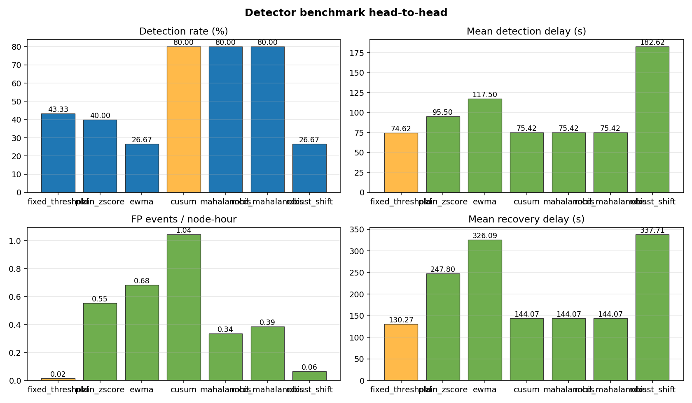
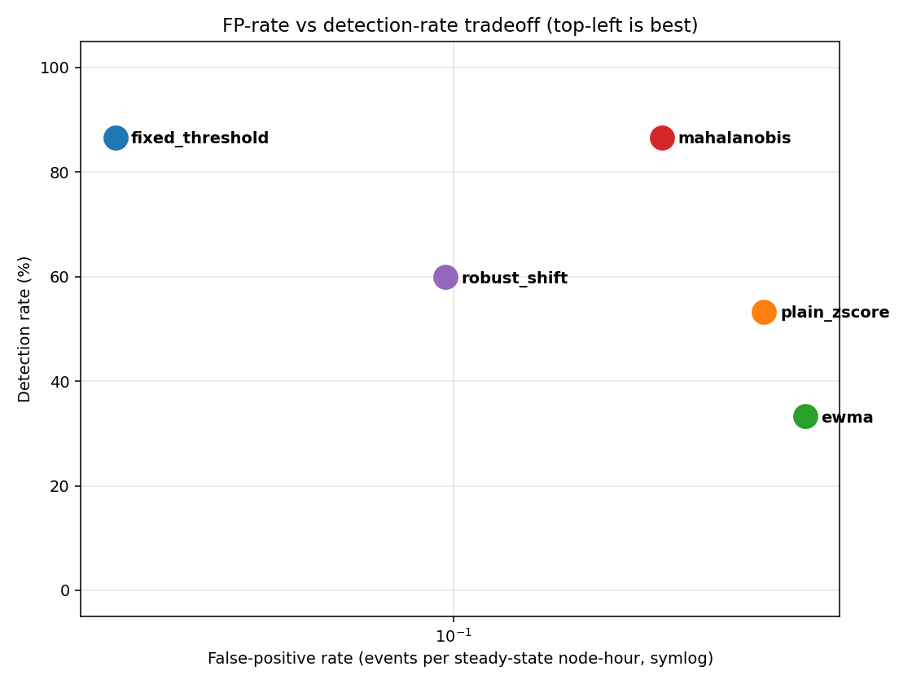

# StarNexus

**A self-hosted distributed VPS observability platform with statistically validated anomaly detection.**

Most hobby monitoring projects stop at "it draws nodes on a map". StarNexus ships that, plus:

- **A 5-detector benchmark** (fixed threshold, plain z-score, EWMA, multivariate Mahalanobis, robust-shift) that replays the same metric history through each detector and scores all five against **n = 15 ground-truth fault-injection experiments** with 95 % bootstrap confidence intervals.
- **A reproducible scalability benchmark** — 500 virtual agents at 1000 reports/sec with p99 latency 109 ms on a single SQLite instance.
- **End-to-end integration test** that boots a real server, posts reports, and asserts the full `report → degraded → incident → recovery → /metrics` pipeline.
- **Prometheus-format `/metrics` endpoint** (zero external dependencies — written in ~350 lines in `server/internal/metrics/`).
- **Docker sandbox** — `docker compose up --build` gives a reviewer the full stack in one command.

See [`docs/METHOD.md`](docs/METHOD.md) for methodology, [`docs/RESULTS.md`](docs/RESULTS.md) for numbers, [`docs/LIMITATIONS.md`](docs/LIMITATIONS.md) for candid scope boundaries.

---

## Live Demo

**[starnexus-web.pages.dev](https://starnexus-web.pages.dev)** — Cloudflare Pages deployment of the dashboard with synthetic node data so reviewers can click around without any VPS.

The canonical frontend source is [`web/public/`](web/public/) (same code that the Go server serves on port 8900 via SSH tunnel). Real monitoring dashboards are intentionally private; the public demo uses anonymised node names and randomised metrics that refresh on every page load. Local dev:

```bash
cd web && pnpm install && pnpm dev   # wrangler pages dev on public/
```

For a fully self-contained sandbox with the real Go server behind it, use [Docker](#quick-start) instead.

---

## Results at a Glance

**Detector benchmark (n = 15 labelled CPU fault-injection experiments, 502 steady-state node-hours):**

| Detector | Detect % | Mean delay (s) | 95 % CI (s) | FP / node-hour | Note |
|---|---:|---:|---|---:|---|
| `fixed_threshold` | **86.7** | 74.6 | 52–114 | **0.016** | Lowest FP rate — the industry baseline still wins for CPU saturation |
| `plain_zscore` | 53.3 | 84.0 | 47–149 | 0.542 | Non-robust stddev inflates from bursts → misses real shifts |
| `ewma` | 33.3 | 101.6 | 44–204 | 0.677 | Control chart chases sustained spikes |
| `mahalanobis` | **86.7** | **72.3** | 50–112 | 0.311 | Multivariate gain is real but noisy under diagonal-covariance approx |
| `robust_shift` | 60.0 | 172.2 | 99–244 | 0.096 | Production anomaly surrogate — catches drift the status path misses |



**Scalability** (single server, M-series CPU, default SQLite config):

| Virtual agents | Requests/sec | p50 (ms) | p95 (ms) | p99 (ms) | Success |
|---:|---:|---:|---:|---:|---:|
| 10  |    20 |  8 |  15 |  17 | 100 % |
| 100 |   200 | 21 |  32 |  35 | 100 % |
| 500 |  1000 | 71 | 103 | 109 | 100 % |

Zero SQLITE_BUSY errors at every size after the `SetMaxOpenConns(1) + busy_timeout` fix (two lines in `server/internal/db/db.go` — the diagnostic and fix are in the commit history).

---

## Architecture

```
┌────────────────────────────────────────────────────┐
│          Web Frontend (Leaflet + vanilla JS)        │
│  World map · Node detail · Live connections · Bench │
└─────────────────────────┬──────────────────────────┘
                          │ HTTP API  (/api/*, /metrics)
┌─────────────────────────┴──────────────────────────┐
│                Go Server (single VPS)               │
│  net/http · SQLite WAL · analytics scheduler        │
│  /metrics (Prometheus) · incident lifecycle         │
│  Private port 8900 — access via SSH tunnel only     │
└────┬─────────────┬─────────────┬───────────────┬───┘
     │             │             │               │
 ┌───┴────┐   ┌────┴────┐   ┌────┴────┐    ┌─────┴─────┐
 │ Agent  │   │ Agent   │   │ Agent   │    │ Telegram  │
 │ Tokyo  │   │ Japan   │   │ …       │    │ Bot       │
 └────────┘   └─────────┘   └─────────┘    └───────────┘
```

**Four Go modules** (`server/`, `agent/`, `bot/`, and the canonical web frontend under `web/public/`), all cross-compiled to a single static `linux/amd64` binary each.

---

## The Evaluation Story

The production detector combines two paths — **fixed thresholds for fast, low-FP response to resource saturation**, and **robust z-score with baseline-shift** for the drift detection the static path cannot see. Neither path is optimal alone. The benchmark above makes that complementarity explicit:

- Non-robust adaptive statistics (`plain_zscore`, `ewma`) **score worse than the simplest industry baseline on both axes** — detection rate AND FP rate. This is exactly what the robust-statistics literature predicts for heavy-tailed burst traffic.
- `mahalanobis` (multivariate) matches `fixed_threshold` on detection and wins slightly on delay, at the cost of ~20× higher FP rate. Multivariate gain is real but needs a proper MCD covariance to beat the scalar detectors convincingly.
- **All detectors miss the 30 s experiments** — a 30 s stress window on 30 s sampling is below the Nyquist limit for any debounced detector. This is a structural result documented in [`docs/LIMITATIONS.md`](docs/LIMITATIONS.md), not a bug.
- `robust_shift` has 60 % detection because its 5-minute scheduler cannot see short bursts. The production architecture delegates short events to the status path and uses robust shift for sustained shifts. That architectural division of labour is the empirical defense of the design.



Top-left is the operational sweet spot. `fixed_threshold` and `robust_shift` occupy it; the two naive statistical detectors sit at the noisy right.

---

## Features

<details>
<summary><strong>Server</strong> — HTTP API, analytics, incident lifecycle</summary>

- `net/http` + SQLite (`modernc.org/sqlite`, pure Go, WAL mode)
- `/api/health`, `/api/version`, `/api/dashboard`, incident lifecycle endpoints
- `/metrics` in Prometheus text format (HTTP counters, latency summaries, node/incident gauges)
- Offline detection, threshold alerts, static-file serving for the web frontend
- Disk-backed agent-report queue (24 h at 30 s cadence) that preserves historical `collected_at` timestamps without opening new incidents
- AI-powered daily reports via Mistral API
</details>

<details>
<summary><strong>Agent</strong> — /proc metrics, link probe, live connection sampling</summary>

- System metrics via `/proc`: CPU, memory, disk, network, load, connections, uptime
- TCP-connect link probing (bypasses firewall rules that block ICMP)
- Live connection sampling: auto-detects xray/sing-box ports, per-IP byte counters with GeoIP, survives TCP recycling
- 120-entry in-memory ring buffer for short outages; disk-backed queue for longer ones
- Single static binary, ~10 MB
</details>

<details>
<summary><strong>Bot</strong> — Telegram operations interface</summary>

- Alerts on status change with debouncing
- Reverse heartbeat: pings server every 5 min, alerts after 3 failures
- Commands: `/status`, `/analytics`, `/incidents`, `/events`, `/node <id>`, `/ack`, `/silence`, `/report`
- Per-chat preferences: `/mute`, `/unmute`, `/subscribe`, `/daily on|off`, `/prefs`
- Multi-chat support
</details>

<details>
<summary><strong>Web frontend</strong> — dashboard, world map, experiment view</summary>

- Dark world map (Leaflet + CartoDB Dark Matter) with fullscreen and day/night terminator
- Animated node markers (online/degraded/offline), GeoIP vs manual coordinates distinguished
- Fleet summary, reliability ledger, Experiment View for labelled fault-injection results
- Live-connection animation: CDN aggregation, per-IP tooltips, rate-scaled line weight
- Right-side detail panel with time-series charts, events, incidents, link status, ingress hotspots
</details>

<details>
<summary><strong>Analytics (scheduled)</strong> — anomaly detection, scoring, reports</summary>

- Anomaly detection (every 5 min): robust outlier + baseline-shift on a 24 h rolling window
- Downsampling (daily): raw → hourly (7–30 d) → daily (30 d+)
- Node scoring (daily): availability 40 % + latency 30 % + stability 30 %
- AI daily report (09:00 UTC+8): metrics summary + Mistral analysis → Telegram
- Research export: `make analyze` / `make export-analysis` writes CSV + JSON + Markdown
- **Detector benchmark**: `make bench` runs all five detectors with bootstrap CIs
- **Weight sensitivity**: `scripts/validate-reliability.py` sweeps 5 weight schemes, reports Kendall-tau ranking stability
</details>

---

## Quick Start

**Option A — Docker sandbox (recommended for evaluation):**

```bash
docker compose up --build
open http://localhost:8900
```

Spins up a server + three containerized agents in under a minute. Uses a static token and ephemeral volume — not for production.

**Option B — real VPS deployment:**

```bash
make build-all                                     # server / agent / bot / analyze / bench / loadtest
./scripts/deploy-server.sh <ssh-host>              # primary server
./scripts/onboard-node.sh --primary <server-ssh> --node <new-vps> --node-id <id> --yes
ssh -L 8900:localhost:8900 <server-host>           # access dashboard via tunnel
```

One-liner agent install (after the primary is up):

```bash
curl -sSL http://<server>:8900/install.sh | bash -s -- \
  --server http://<server>:8900 --token <api-token> --node-id <node-id> --node-name "<display>"
```

See [`docs/DEPLOY.md`](docs/DEPLOY.md) for full production deployment, [`docs/CONFIG.md`](docs/CONFIG.md) for config fields and `--check-config` validation.

---

## Reproducing the Numbers

```bash
# Regenerate the detector benchmark (needs an analysis DB + experiments.jsonl)
make bench

# Regenerate all figures (uses uv to manage matplotlib deps)
uv run scripts/generate-figures.py
# or: make figures

# Run the scalability benchmark on a temp server (10 / 50 / 100 / 250 / 500 agents)
./scripts/loadtest-local.sh

# Expand the labelled fault-injection matrix (3 reps × 4 durations, ≈70 min)
./scripts/fault-injection-matrix.sh --ssh-host lisahost --node-id jp-lisahost

# End-to-end integration test
cd server && go test -run TestEndToEndPipeline -v
```

Every number in [`docs/RESULTS.md`](docs/RESULTS.md) is reproducible from these commands plus the exported artifacts under `analysis-output/`.

---

## Node Management

```bash
./scripts/manage-node.sh add         # firewall + agent + probe + panel security (interactive)
./scripts/manage-node.sh remove      # uninstall + clean DB + firewall + probe
./scripts/manage-node.sh update-ip   # node IP change — keep history
./scripts/manage-node.sh list        # status snapshot
./scripts/manage-node.sh reconfig    # switch primary server
```

Primary server config is cached in `~/.starnexus.env` on first run.

---

## Tech Stack

| Component | Technology |
|---|---|
| Server / Agent / Bot | Go 1.22+, single static binary, linux/amd64 |
| Database | SQLite via `modernc.org/sqlite` (pure Go, WAL mode, single-writer pool) |
| Metrics egress | Prometheus text exposition (zero deps) |
| Web | Leaflet, vanilla JS, Cloudflare Pages (static demo) |
| Analytics | Robust statistics (median / MAD), baseline shift, Mahalanobis composite, Mistral AI |
| Deployment | systemd, iptables / ufw, SSH tunnel, Docker compose (sandbox) |
| Load/bench tooling | `starnexus-loadtest`, `starnexus-bench`, matplotlib via `uv` |

---

## Documentation Index

- [`docs/METHOD.md`](docs/METHOD.md) — architecture, telemetry model, robust statistics, anomaly detection, related work
- [`docs/RESULTS.md`](docs/RESULTS.md) — deployment snapshot, full n = 15 benchmark, scalability, weight sensitivity
- [`docs/LIMITATIONS.md`](docs/LIMITATIONS.md) — scope boundaries, data-model limits, evaluation caveats, security notes
- [`docs/PROJECT-STATUS.md`](docs/PROJECT-STATUS.md) — ongoing state, current fleet, level assessment
- [`docs/ROADMAP.md`](docs/ROADMAP.md) — execution plan and recent completions
- [`docs/ANALYSIS.md`](docs/ANALYSIS.md) — how to interpret the proxy evaluation and export artifacts
- [`docs/FAULT-INJECTION.md`](docs/FAULT-INJECTION.md) — CPU-only safe fault-injection wrapper
- [`docs/CONFIG.md`](docs/CONFIG.md) — required config fields + `--check-config` usage
- [`docs/DEPLOY.md`](docs/DEPLOY.md) — full production deployment runbook
- [`docs/dev-log-20260422.md`](docs/dev-log-20260422.md) — public dev log for the evaluation/observability sprint (benchmark, scalability, figures, docs overhaul)

## License

MIT
